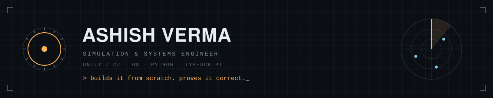
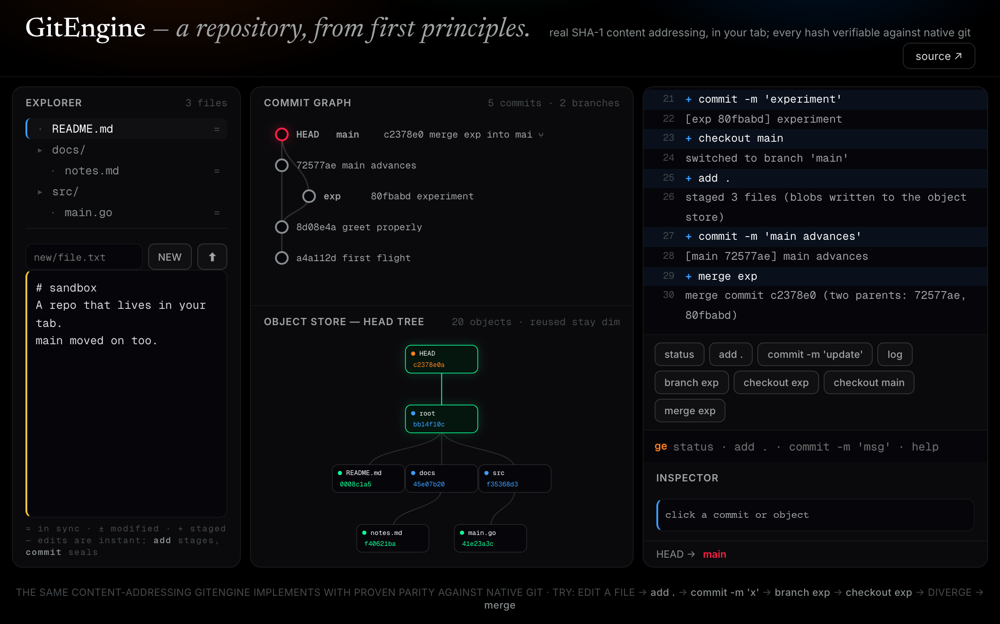
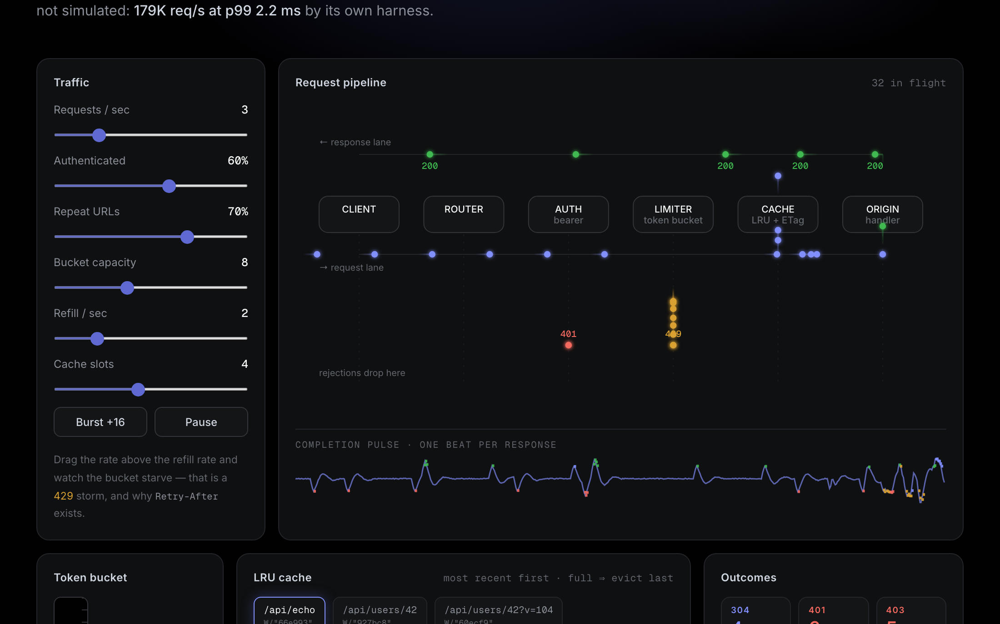
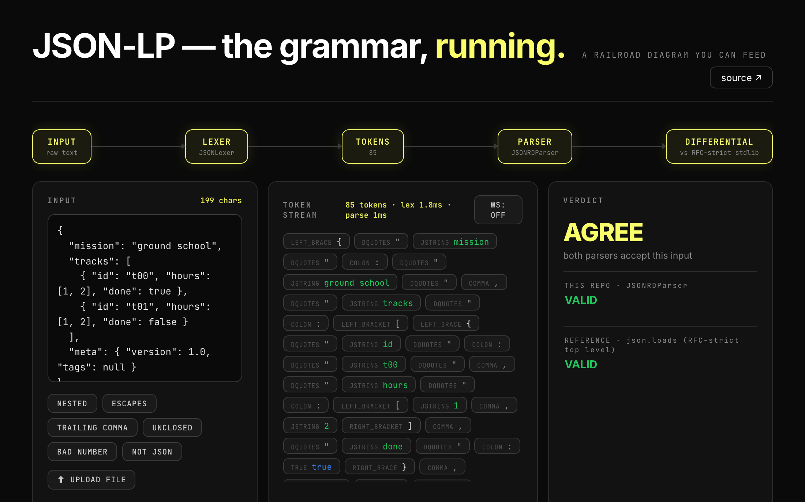
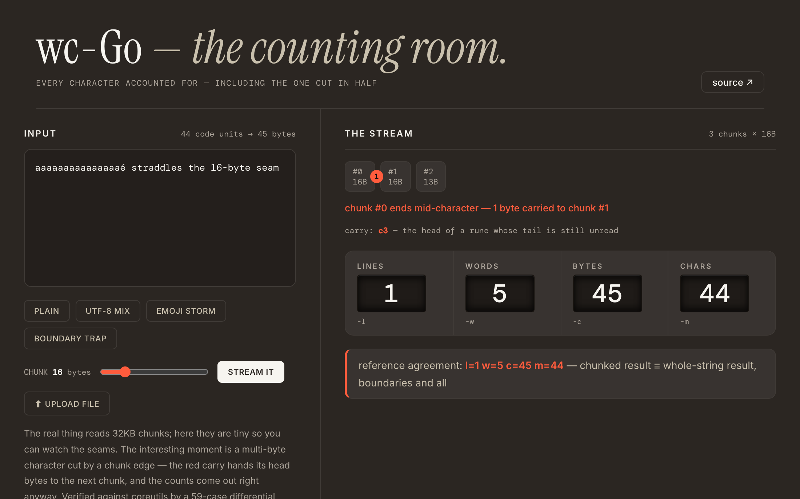

<picture>
  <source media="(prefers-color-scheme: light)" srcset="assets/banner-light.svg">
  
</picture>

I build foundational systems from scratch — an HTTP stack on raw TCP, Git from first
principles, parsers, flight simulation — and then do the part most from-scratch projects
skip: **prove they're correct**. Differential suites against the reference implementation,
wire-level conformance tests, benchmark harnesses that live in the repo next to the code
they measure.

<picture>
  <source media="(prefers-color-scheme: light)" srcset="assets/panel-light.svg">
  
</picture>

Not vanity metrics — each gauge is a number produced by a test or benchmark harness
committed in the repo it describes. The panel itself is [generated by a script](scripts/render_instruments.py),
because a hand-drawn precision instrument would be a contradiction.

<picture>
  <source media="(prefers-color-scheme: light)" srcset="assets/recorder-light.svg">
  
</picture>

One channel per repo, [redrawn daily by a workflow](.github/workflows/flight-recorder.yml)
from the commit stats API. Every channel is auto-gained to its own peak — and the peak is
printed, so the gain is never a lie.

## The playgrounds

Every repo ships a live, interactive playground on its own Pages — same night, four rooms.
Click through; each one starts flying itself until you touch it.

<table>
<tr>
<td width="50%">

<b><a href="https://brickster241.github.io/GitEngine/">GitEngine · review room</a></b> — add, commit, branch, merge; every SHA verifiable against native git
</td>
<td width="50%">

<b><a href="https://brickster241.github.io/PulseHTTP/">PulseHTTP · strip chart</a></b> — starve the token bucket yourself; 401 ≠ 403, live tallies
</td>
</tr>
<tr>
<td width="50%">

<b><a href="https://brickster241.github.io/JSON-Lexer-Parser-From-Scratch/">JSON-LP · railroad</a></b> — the repo's real parser via Pyodide; every keystroke is a differential test
</td>
<td width="50%">

<b><a href="https://brickster241.github.io/wc-Go/">wc-Go · counting room</a></b> — watch a rune get cut by a 32KB seam and counted correctly anyway
</td>
</tr>
</table>

## Selected work

| | What it is | The proof |
|---|---|---|
| **[GitEngine](https://github.com/brickster241/GitEngine)** | Git rebuilt from first principles in Go — 17 commands, three-way merge (diff3), rebase | Byte-for-byte SHA parity with native git, enforced by a differential test suite; 2× git's bulk ingest — **[watch hashes cascade live](https://brickster241.github.io/GitEngine/)** |
| **[PulseHTTP](https://github.com/brickster241/PulseHTTP)** | Production-shaped HTTP/1.1 stack on raw TCP in Go, zero dependencies — router, auth, rate limiting, LRU+ETag cache, TLS, keep-alive proxy | 179K req/s @ p99 2.2 ms by its own harness; 39-test conformance suite — **[fly the pipeline yourself](https://brickster241.github.io/PulseHTTP/)** |
| **[JSON-Lexer-Parser](https://github.com/brickster241/JSON-Lexer-Parser-From-Scratch)** | JSON lexer + recursive-descent parser in pure Python, typed errors, bounded depth | 98-case differential vs RFC-strict stdlib: 0 disagreements; 572K tokens/s — **[run it in your browser](https://brickster241.github.io/JSON-Lexer-Parser-From-Scratch/)** |
| **[groundschool-skill](https://github.com/brickster241/groundschool-skill)** | A Claude Code skill that reads a repository and writes you a course about it — local-first dashboard, verified code anchors, append-only updates | Self-hosting: the **[live demo](https://brickster241.github.io/groundschool-skill/)** is the skill run on its own repo |
| **[wc-Go](https://github.com/brickster241/wc-Go)** | Concurrent, streaming `wc` in Go — 32KB chunks, goroutine-per-file | 59/59 differential vs coreutils; lines 3.9×, chars up to 12.8×, 100-file fan-out 3.5× — **[watch the boundary carry](https://brickster241.github.io/wc-Go/)** |

## How I decide what's true

- **Differential testing over unit vibes.** When a reference implementation exists — native
  git, the RFC-strict stdlib parser — the test is *agree with it on everything*, not
  *pass the cases I thought of*.
- **Measured, not estimated.** A performance claim without a committed harness is a rumor.
  Every number above has a script you can run.
- **From scratch, on purpose.** Rebuilding a thing is how I earn the right to reason about
  it — the wire format, the index layout, the state machine — not a bet against using
  the real one in production.

## Day job

Flight-simulation engineering — Unity/C#, multiplayer VR training systems, ML-assisted
flight-data analysis. The night-cockpit look above is an occupational hazard.

---

<code>READ THE CODE · PROVE IT BY CHANGING ONE THING · WRITE IT DOWN</code>

